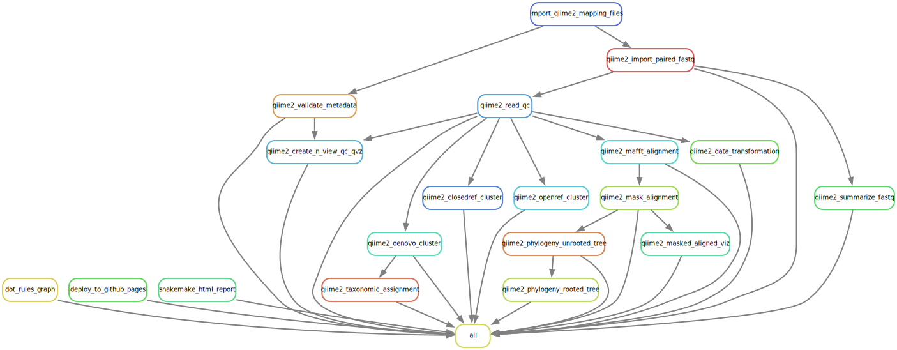

<div id="main-container">

<link rel="preconnect" href="https://fonts.googleapis.com">
<link rel="preconnect" href="https://fonts.gstatic.com" crossorigin>
<link href="https://fonts.googleapis.com/css2?family=Anton" rel="stylesheet">
<link href="https://fonts.googleapis.com/css2?family=Roboto:wght@100;300;400;500;700,900&display=swap" rel="stylesheet">
<link href="https://fonts.googleapis.com/css2?family=Oswald:wght@300;400;700&display=swap" rel="stylesheet">
<link href="https://fonts.googleapis.com/css2?family=Merriweather:wght@300;400;700&display=swap" rel="stylesheet">
<link href="https://fonts.googleapis.com/css2?family=Montserrat:wght@100;200;300;400;700&display=swap" rel="stylesheet">

```{r globalsetup, echo=FALSE, message=FALSE, warning=FALSE}
knitr::opts_chunk$set(
  echo  =FALSE,
  message  =FALSE,
  warning  =FALSE,
  cache  =FALSE,
  comment  =NA,
  fig.path='./figures/',
  fig.show='asis',
  dev  ='png',
  fig.align='center',
  out.width  ="70%",
  fig.width  =7,
  fig.asp  =0.7,
  fig.show  ="asis"
)

library(tidyverse, suppressPackageStartupMessages())
library(schtools)
```

# Microbiome analysis with QIIME2

...BRIEF INTRO IN PROGRESS...

<br>

```{bash ruledag, include=FALSE}
bash workflow/scripts/rules_dag.sh
```



A tentative snakemake workflow that defines **qiime2 bioinformatics rules** in a DAG (directed acyclic graph) format. 
A detailed interactive snakemake HTML report is available [here](https://complexdatainsights.com/imap/imap-bioinformatics-qiime2/report.html). 
You will be able to explore the workflow and the associated statistics. You can close the left bar (overlap) to get a more expansive display view.


<br>

```{r child='workflow/scripts/01_qiime2_getting_started.Rmd'}
```

<br>

```{r child='workflow/scripts/02_qiime2_seq_clustering.Rmd'}
```

## Preparing SILVA reference database
How? As described [here](https://forum.qiime2.org/t/processing-filtering-and-evaluating-the-silva-database-and-other-reference-sequence-data-with-rescript/15494)


<br><hr width=100%><br>

## Related work
```{block imaprepos, echo=TRUE}

| Repo | Description | Status |
|:-----------------------|----------------------------------|--------------:|
| [IMAP-GLIMPSE](https://github.com/datainsights/imap-project-overview/) | IMAP project overview | [In-progress](https://datainsights.github.io/imap-project-overview/) |
| [IMAP-PART 01](https://github.com/tmbuza/imap-software-requirements/) | Software requirement for microbiome data analysis with Snakemake workflows | [In-progress](https://tmbuza.github.io/imap-software-requirements/) |
| [IMAP-PART 02](https://github.com/tmbuza/imap-sample-metadata/) | Downloading and exploring microbiome sample metadata from SRA Database | [In-progress](https://tmbuza.github.io/imap-sample-metadata/) |
| [IMAP-PART 03](https://github.com/tmbuza/imap-download-sra-reads/) | Downloading and filtering microbiome sequencing data from SRA database | [In-progress](https://tmbuza.github.io/imap-download-sra-reads/) |
| [IMAP-PART 04](https://github.com/tmbuza/imap-read-quality-control/) | Quality Control of Microbiome Next Generation Sequencing Reads | [In-progress](https://tmbuza.github.io/imap-read-quality-control/) |
| [IMAP-PART 05](https://github.com/tmbuza/imap-bioinformatics-mothur/) | Microbial profiling using MOTHUR and Snakemake workflows | [In-progress](https://tmbuza.github.io/imap-bioinformatics-mothur/) |
| [IMAP-PART 06](https://github.com/tmbuza/imap-bioinformatics-qiime2/) | Microbial profiling using QIIME2 and Snakemake workflows | [In-progress](https://tmbuza.github.io/imap-bioinformatics-qiime2/) |
| [IMAP-PART 07](https://github.com/tmbuza/imap-data-processing/) | Processing Output from 16S-Based microbiome bioinformatics pipelines| [In-progress](https://tmbuza.github.io/imap-data-processing/) |
| [IMAP-PART 08](https://github.com/tmbuza/imap-exploratory-analysis/) | Exploratory Analysis of 16S-Based Microbiome Processed Data | [In-progress](https://tmbuza.github.io/imap-exploratory-analysis/) |
| [IMAP-SUMMARY](https://github.com/tmbuza/imap-snakemake-workflows/) | Summary of snakemake workflows for microbiome data analysis | [In-progress](https://tmbuza.github.io/imap-snakemake-workflows/) |
```

## Citation

> Please consider citing the iMAP article [@TMBuza2019] if you find any part of the IMAP practical user guides helpful in your microbiome data analysis.

<br>

# References
::: {#refs}
:::

<br><hr width=100%><br>

# Appendix {-}

## Project main tree
```{bash, include=FALSE}
bash workflow/scripts/tree.sh
```

```{bash treeimg}
cat results/project_tree.txt
```

<br>


<br>


## Troubleshooting of FAQs
<ol>
  <li>Question</li>
    <ul>Answer</ul>
  <li>Question</li>
    <ul>Answer</ul>
</ol>


</div> <!-- end main-container -->

<br><hr width=100%><br>

<div id="footer">
Last updated on `r format(Sys.time(), '%B %d, %Y')`.<br>
Github_Repo: `r rmarkdown::metadata$github_repo`.<br>
Repo compiled and maintained by: [`r rmarkdown::metadata$author`](mailto:`r rmarkdown::metadata$email_address`). 
</div>
